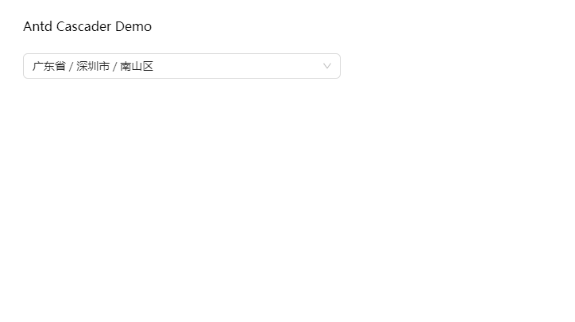

# Antd Cascader Demo with China Division

基于 [china-division](https://github.com/modood/Administrative-divisions-of-China) 项目, 提供中国省市区数据并提供相应的 Antd Cascader 级联选择框 Demo

可以用来参考使用 `china-division >= 2.7.0` 的数据使用

## 数据更新

如有更新数据的需求，请修改china-division版本即可。

## 项目文件

`src/index.tsx`

## 组件效果

